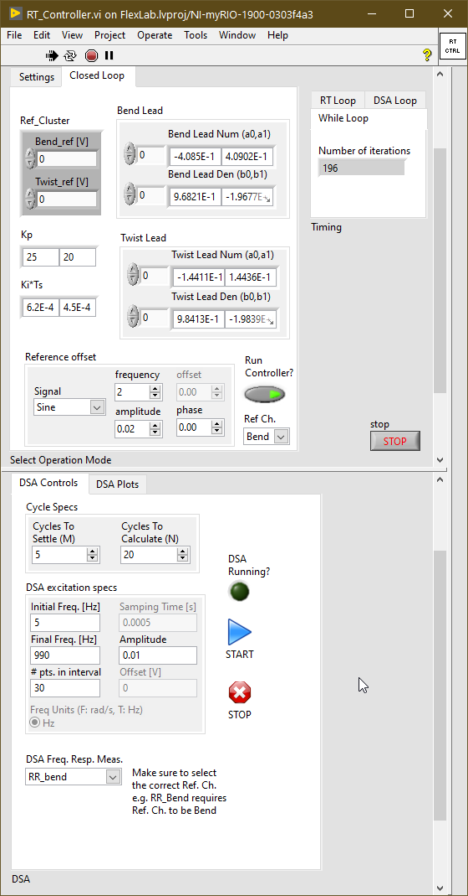
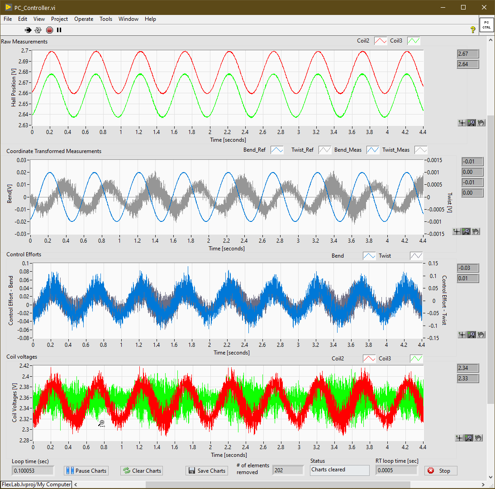

# FlexLab
Code for implementing closed loop control on the FlexLab system

**FPGA:** Low level ADC, Moving Average, Controller and DAC.

**RT-target:** Reads data from FPGA at a specified loop rate for transfer to Host-PC over TCP/IP for analysis. Also provides a UI to modify FPGA controls as needed. 

**Host-PC:** Reads data from the RT-target and performs spectral analysis - Power Spectral Density and Cumulative Power Spectrum and plots them in the UI.

**Run RT Code and then PC code.** Open FlexLab.lvproj and then RT_Controller.vi and PC_Controller.vi for running the controller. For the sensor noise characterization run RT_AIChar.vi and then the PC_AIChar.vi. The Histogram and PSD analysis is in the PC_AIChar VI. You can select various options for AI sampling in the RT_AIChar VI. Select the correct Target to set the IP address for the STM messaging server.

To run this in LabVIEW, download and install the following packages from [VI Package Manager](http://www.ni.com/tutorial/54770/en/):
1. Simple Messagine Library (STM) - [vipm://ni_lib_stm/?repo_url=http:/ftp.ni.com/evaluation/labview/lvtn/vipm](vipm://ni_lib_stm/?repo_url=http:/ftp.ni.com/evaluation/labview/lvtn/vipm)
2. Structured Error Handler (SEH) - [vipm://ni_lib_seh/?repo_url=http:/ftp.ni.com/evaluation/labview/lvtn/vipm](vipm://ni_lib_seh/?repo_url=http:/ftp.ni.com/evaluation/labview/lvtn/vipm)
